# StarBox
Mod named StarBox for testing unit compositions.

Created with Blizzard Entertainment's Starcraft 2 Galaxy Editor.
## Features
The mod allows players to test unit compositions for competitive play.
It features:

| Gameplay Features |
| --- |
| Different Testing Terrain |
| Competitive Map Portion |
| Unit Count Tracker|
| Unit Upgrades |
| Advanced Options |
| Resource Tracking |
| Amazing GUI |

| Trigger Features |
| --- |
| Building a database from existing catalog |
| Manipulating the tech tree |
| Advanced dialog system |
| Unit position mirroring relative to terrain |
| Many other |

## How to Use
Run the Galaxy Editor and open the file, it should work.
## Where to Find
The mod is uploaded to all servers, search for StarBox in the arcade.
It is only localized in English.
## How to Play
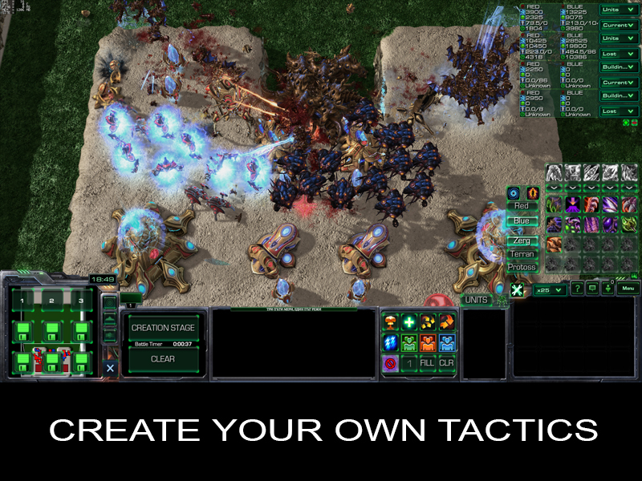
### Terrain
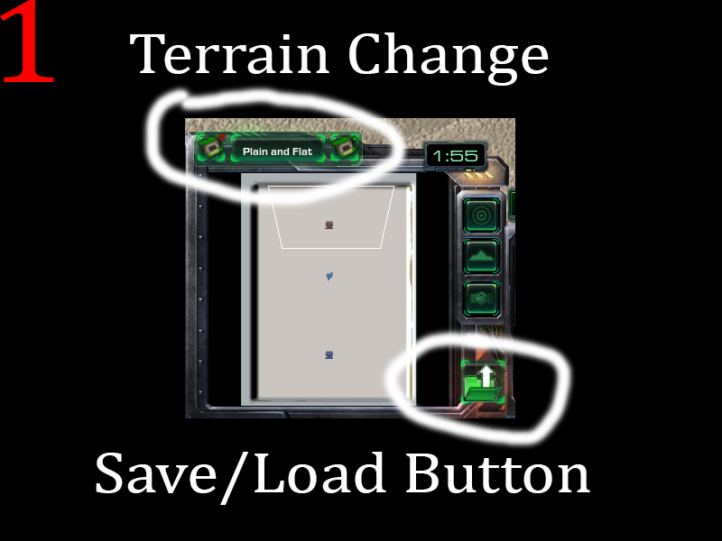
### Stage
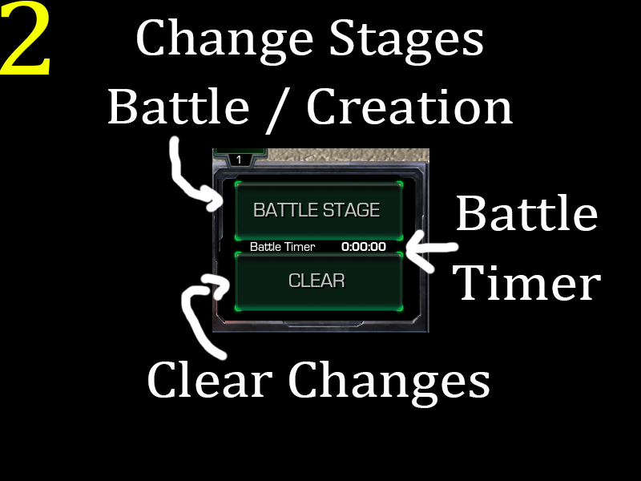
### Spawn
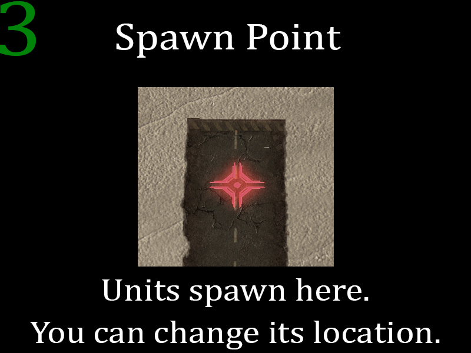
### Upgrades
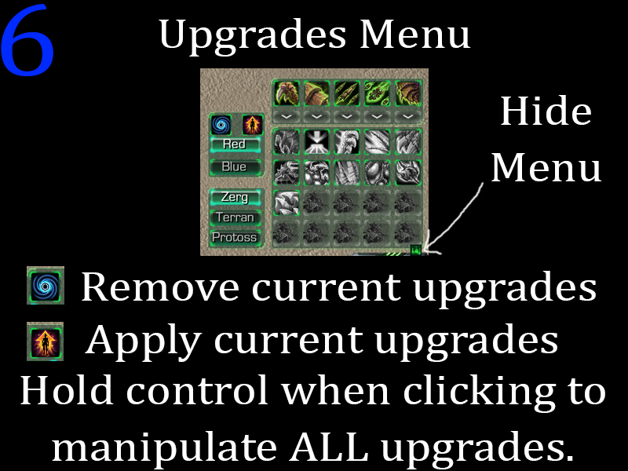
### Abilities
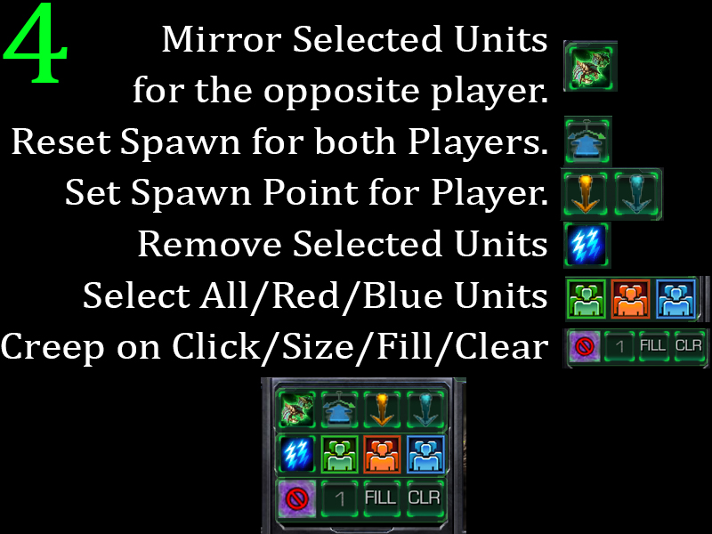
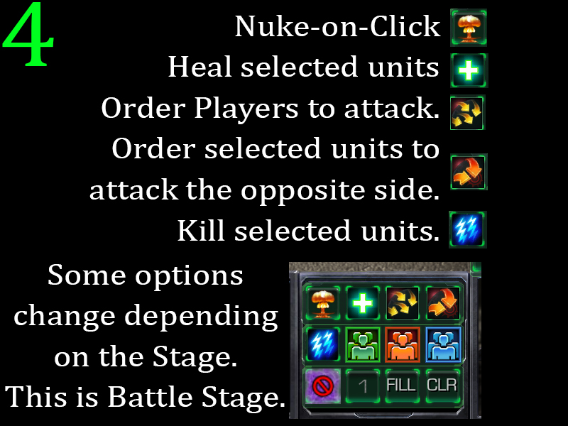
### Unit Creator
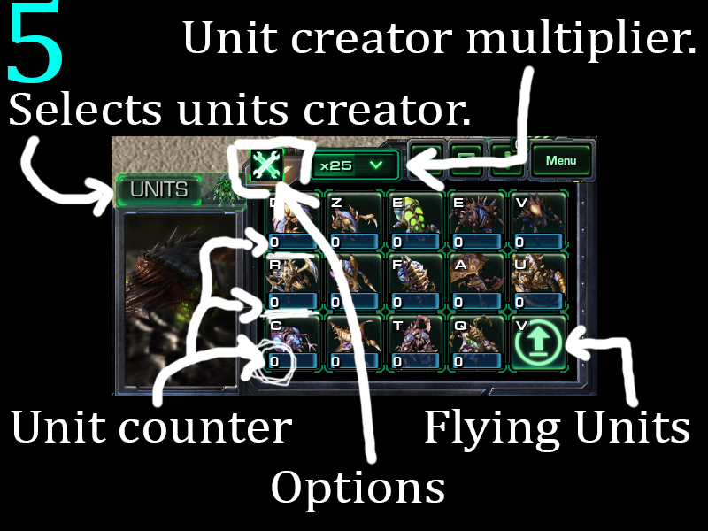
### Options
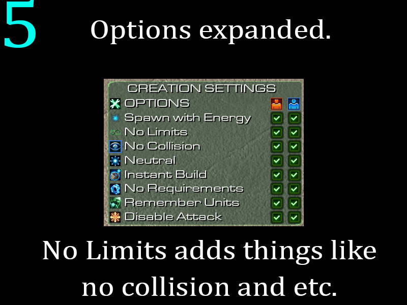
### Battle Options
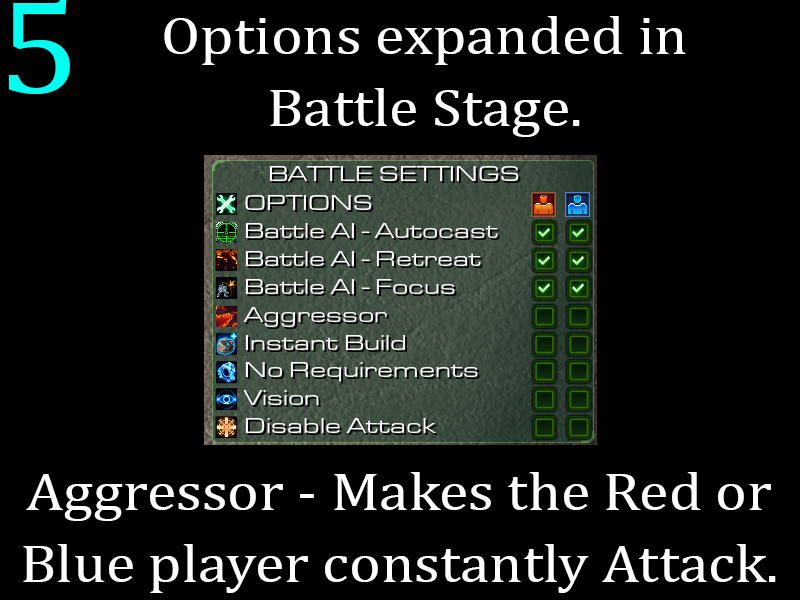
### Resource Table
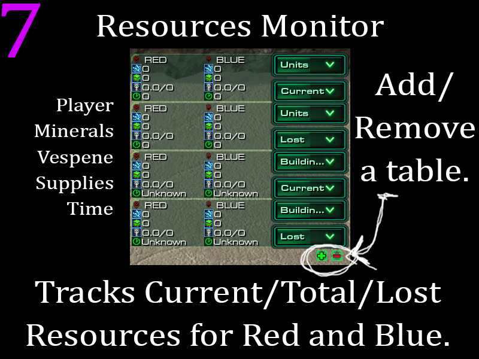
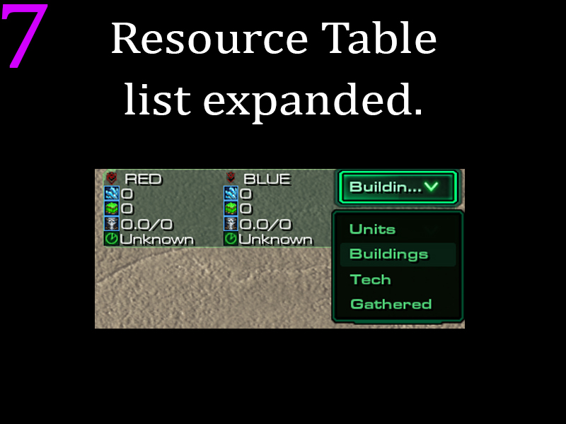

These and more are available in-game.
## Future
I won't be updating the mod further. The last update I made was in 2016, but since it has untouched dependencies it should more or less update itself. 

Anyone is free to further develop the mod.
