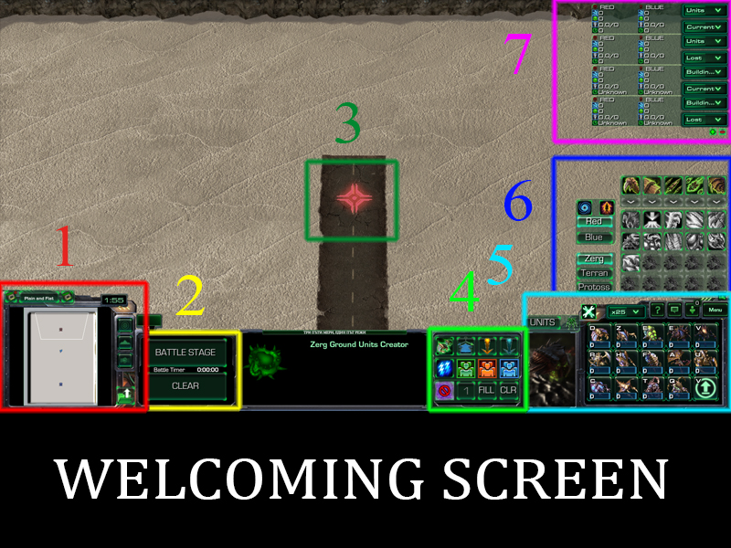

# StarBox

Mod named StarBox for testing unit compositions. 
Created with Blizzard Entertainment's Starcraft 2 Galaxy Editor.
## How to Use
Run the Galaxy Editor and open the file, it should work.
## Where to Find
The mod is uploaded to all servers, search for StarBox in the arcade.
It is only localized in English.
## How to Play

### Terrain

### Stage

### Spawn

### Upgrades

### Abilities

### Unit Creator

### Options

### Battle Options

### Resource Table

These and more are available in-game.
